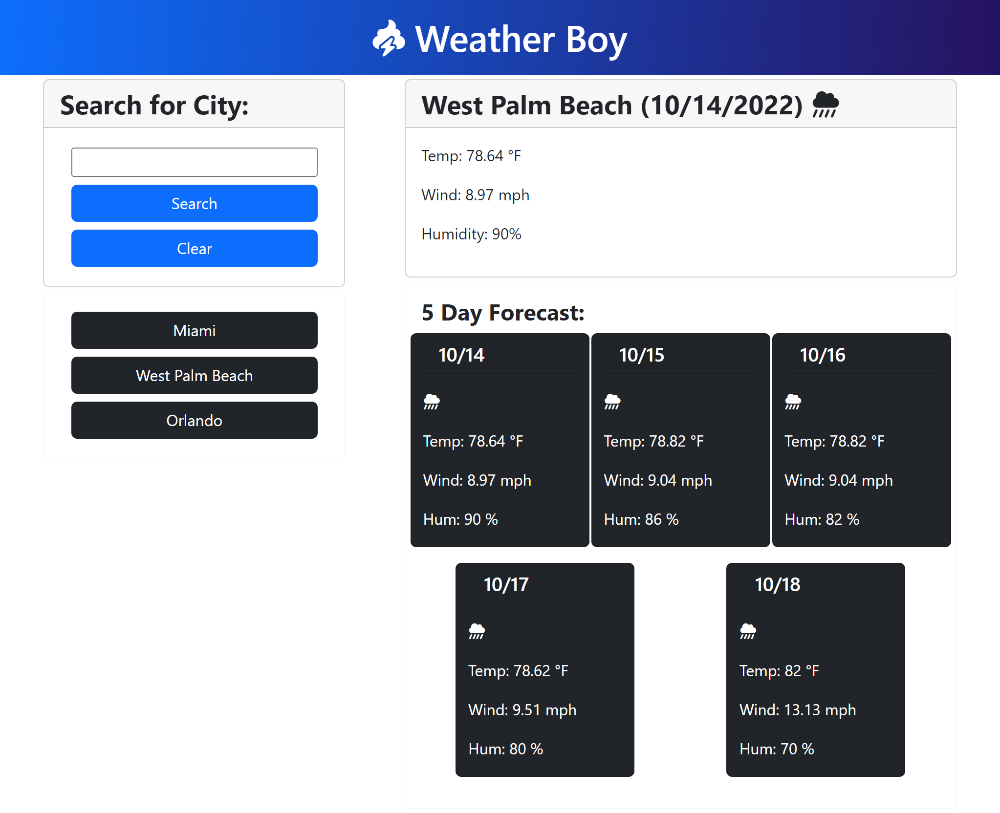

# M6-Weather-Dashboard

## Description

This application uses JavaScript to display the weather in a selected city. When the user types in a city the weather for today and 5 days in the future will appear. The search is added to local storage and a button with all previously searched items will appear. It makes use of 2 API's in order to collect the weather data.
While making this project I learned how to:

- Fetch API's and pull down relevant data
- Work with appending multiple values to a page
- Create, append, and add inner text to an element using JavaScript
- Style using BootStrap and FontAwesome
- Change user input values to be a standard styling. *Ex. ORlaNdO => Orlando*

## Table of Contents

- [Deployment](#deployment)
- [Features](#features)
- [Assignment Instructions](#assignment-instructions)
- [Credits](#credits)
- [License](#license)

## Deployment

### Link

To see the application in action navigate to [https://mateo-wallace.github.io/M6-Weather-Dashboard/](https://mateo-wallace.github.io/M6-Weather-Dashboard/)

### Screenshot



## Features

- Search a city and relevant weather data is printed to webpage.
- Click on Header Icon in order to refresh page. It bounces on hover.
- Responsive page design. When screen is shrunk the app readjusts for mobile.
- When unknown city is input an alert pops up.
- When Clear button is pressed, the local storage is cleared removing search history buttons.

## Assignment Instructions

### User Story

```
AS A traveler
I WANT to see the weather outlook for multiple cities
SO THAT I can plan a trip accordingly
```

### Acceptance Criteria

```
GIVEN a weather dashboard with form inputs
WHEN I search for a city
THEN I am presented with current and future conditions for that city and that city is added to the search history
WHEN I view current weather conditions for that city
THEN I am presented with the city name, the date, an icon representation of weather conditions, the temperature, the humidity, and the wind speed
WHEN I view future weather conditions for that city
THEN I am presented with a 5-day forecast that displays the date, an icon representation of weather conditions, the temperature, the wind speed, and the humidity
WHEN I click on a city in the search history
THEN I am again presented with current and future conditions for that city
```

### Mock-Up

The following image shows the web application's appearance and functionality:


## Credits

OpenWeatherMap.org. (n.d.). 5 Day Weather Forecast. OpenWeatherMap. Retrieved October 14, 2022, from https://openweathermap.org/forecast5 

## License

MIT License

Copyright (c) 2022 Mateo Wallace

Permission is hereby granted, free of charge, to any person obtaining a copy
of this software and associated documentation files (the "Software"), to deal
in the Software without restriction, including without limitation the rights
to use, copy, modify, merge, publish, distribute, sublicense, and/or sell
copies of the Software, and to permit persons to whom the Software is
furnished to do so, subject to the following conditions:

The above copyright notice and this permission notice shall be included in all
copies or substantial portions of the Software.

THE SOFTWARE IS PROVIDED "AS IS", WITHOUT WARRANTY OF ANY KIND, EXPRESS OR
IMPLIED, INCLUDING BUT NOT LIMITED TO THE WARRANTIES OF MERCHANTABILITY,
FITNESS FOR A PARTICULAR PURPOSE AND NONINFRINGEMENT. IN NO EVENT SHALL THE
AUTHORS OR COPYRIGHT HOLDERS BE LIABLE FOR ANY CLAIM, DAMAGES OR OTHER
LIABILITY, WHETHER IN AN ACTION OF CONTRACT, TORT OR OTHERWISE, ARISING FROM,
OUT OF OR IN CONNECTION WITH THE SOFTWARE OR THE USE OR OTHER DEALINGS IN THE
SOFTWARE.